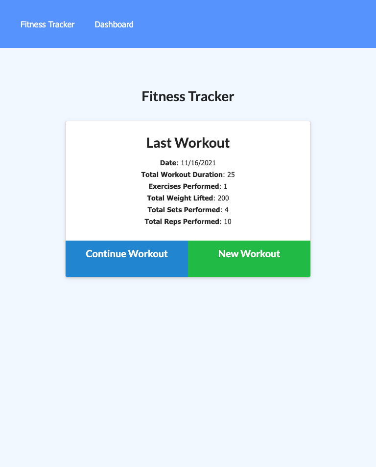
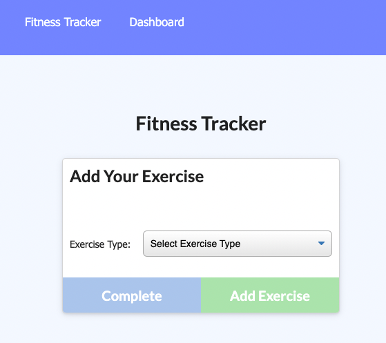
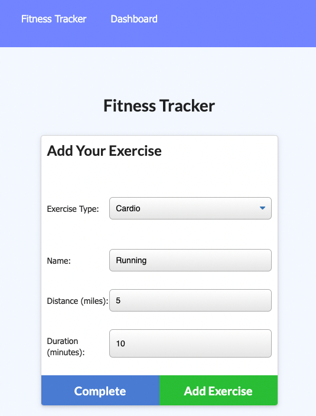
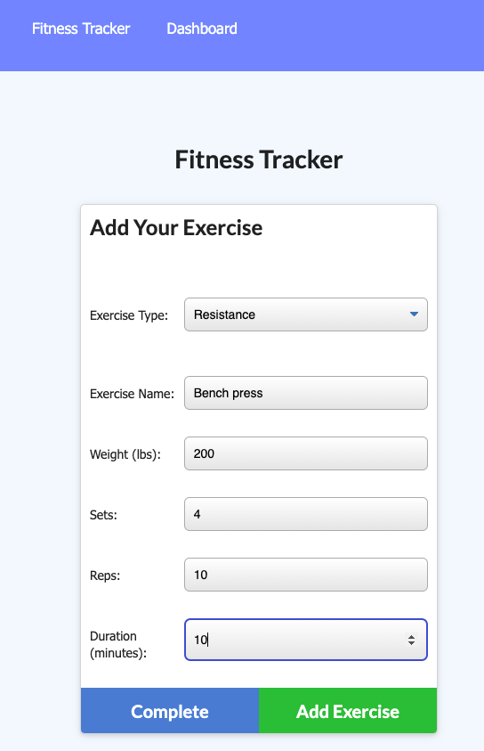
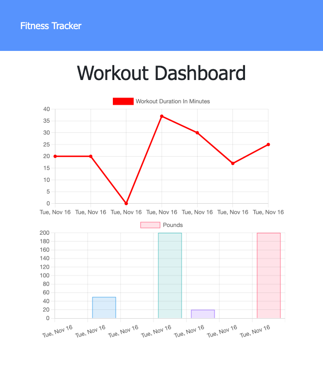

# Workout Tracker 💪

This is a full-stack application to view, create and track a user's daily workouts. The user is able to log multiple exercises in a workout on a given day.  Meanwhile the user can also be able to track the name, type, weight, sets, reps, and duration of exercise. 

## Table of Contents

- [Description](#description)
- [Screenshot for Demo](#screenshot-for-demo)
- [Heroku Application Link](#heroku-application-link)
- [Questions](#questions)

## Description 

When the user loads the page, they should be given the option to create a new workout or continue with their last workout.
The user should be able to:
- Add exercises to the most recent workout plan.
- Add new exercises to a new workout plan.
- View the combined weight of multiple exercises from the past seven workouts on the dashboard page.
- View the total duration of each workout from the past seven workouts on the dashboard page.

## Screenshot for Demo

### Landing page/Home page

### Add New Exercises 

### Dashboard 

## Heroku Application Link
- [Link for Heroku Deployment ](https://workout-tracker-elenal.herokuapp.com/)

## Questions
- For more projects, please visit my [GitHub](https://github.com/elenaliu0415). 
- Please feel free to contact me at elenaliu0415@gmail.com